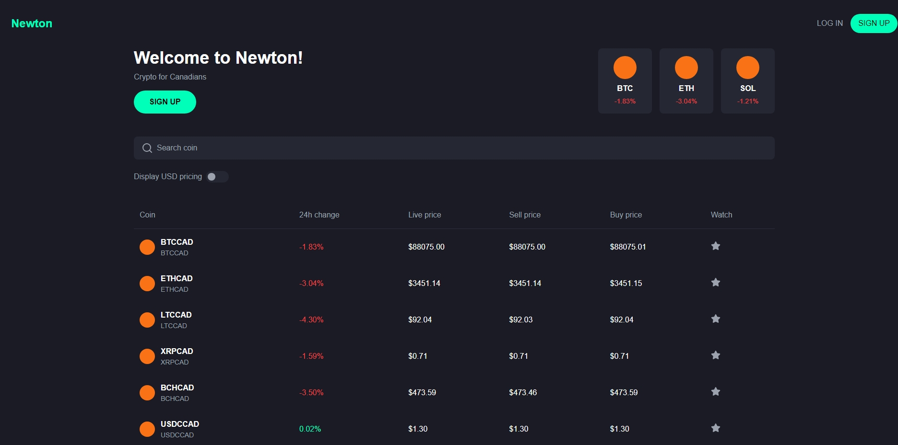

# Newton Tech Assessment

Submitted by: Mark Windsor

Here's a preview of the frontend interface:



This project consists of a Next.js application that consumes real-time market data from a WebSocket server. Im using my favourite package ccxt to stream market data. I then multiply by price data by 1.3 to get CAD values.

Further considersations to implement: search, side bar buttons and switching between cad and usd balues

## Folder Structure

- `newton-assessment-app/`: Next.js application that displays the crypto trading interface
- `websocket-server/`: Node.js server that streams market data via WebSockets


## Installation and Running the Application

### Step 1: Install Dependencies

First, you need to install the dependencies for both the Next.js app and the WebSocket server.


### Step 2: Start the WebSocket Server

Start the WebSocket server to begin streaming market data:

```bash
cd websocket-server
node index.js
```

### Step 3: Start the Next.js App

Start the Next.js app to see the crypto trading interface:

```bash
cd newton-assessment-app
npm run dev
```
